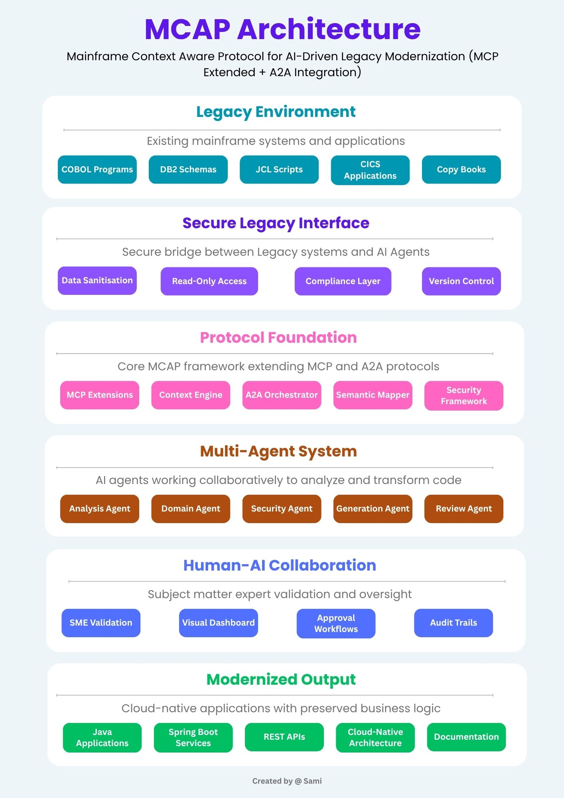

# 🧠 MCAP: Mainframe Context Aware Protocol

MCAP is a proposed protocol architecture for AI-driven legacy modernization. It integrates Anthropic’s Model Context Protocol (MCP) and Google’s Agent2Agent (A2A) to securely analyze COBOL systems using LLMs, while preserving business logic and enabling multi-agent collaboration with human oversight.

> 💡 MCAP = MCP (context-aware tool access) + A2A (agent orchestration) + mainframe security & domain extensions

---

## 📐 Architecture Overview

- 🔒 **Secure Mainframe Interface**: Read-only access to sanitized COBOL, JCL, VSAM, and DB2
- 🧠 **LLM Orchestration**: Multi-agent system for logic extraction, code generation, validation
- 🔄 **Context Graph Engine**: Maintains semantic trace of legacy programs
- 👨‍💼 **SME Validation Layer**: Human-in-the-loop workflows and audit trails
- ☁️ **Modern Output**: Testable Java code, documentation, APIs

---

## 📂 Repository Structure

| Folder         | Purpose                                         |
|----------------|-------------------------------------------------|
| `architecture` | Architecture diagram + written description      |
| `docs`         | Full research paper and protocol documentation  |
| `agents`       | Description of each AI agent in the MCAP model  |
| `security`     | Compliance and data protection considerations   |
| `prototype`    | COBOL samples and LLM-generated outputs         |
| `roadmap`      | Milestones and community collaboration plan     |

---

## 🧪 Status

This is a **research hypothesis**, not a production-ready tool.  
We invite collaborators from mainframe, AI, enterprise architecture, and modernization domains to validate and improve this framework.

📖 Full paper: [`index.md`](./docs/index.md)

